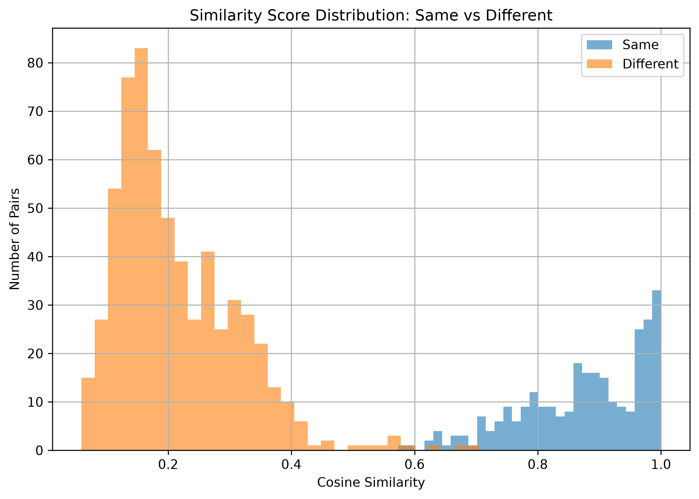
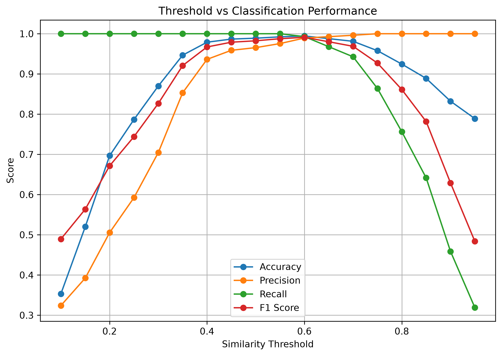
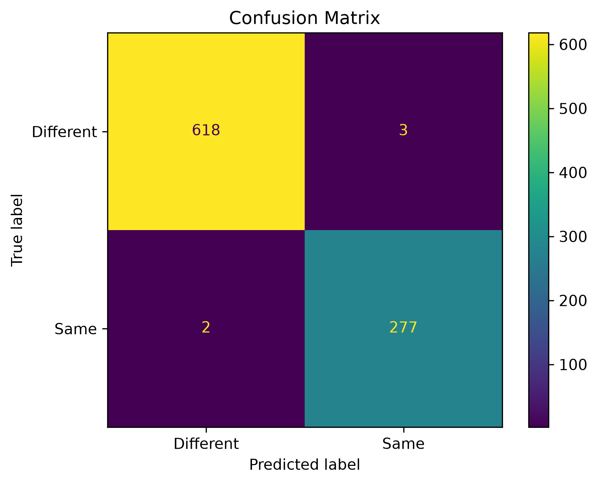
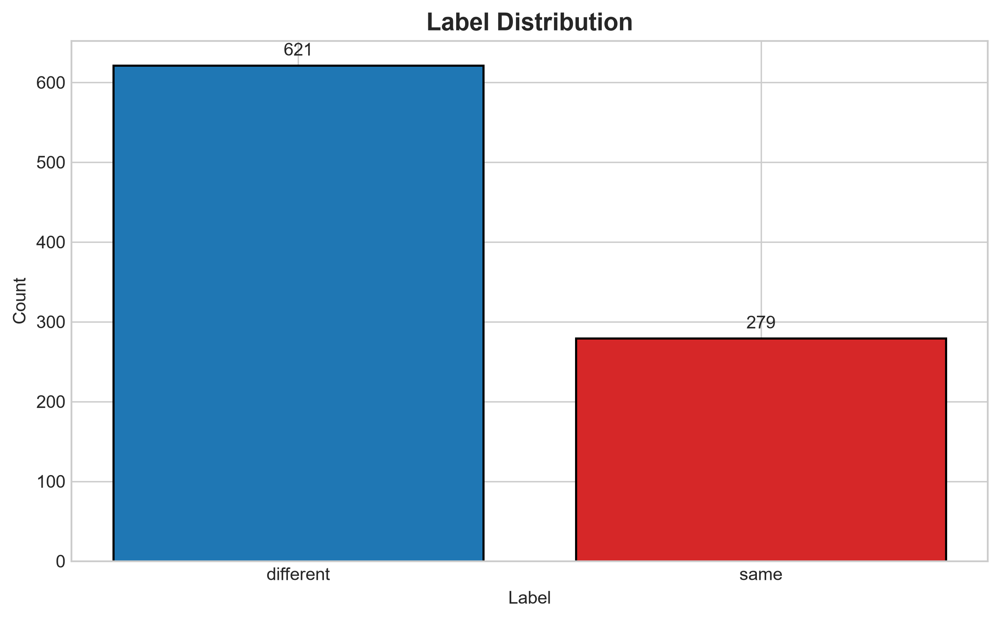
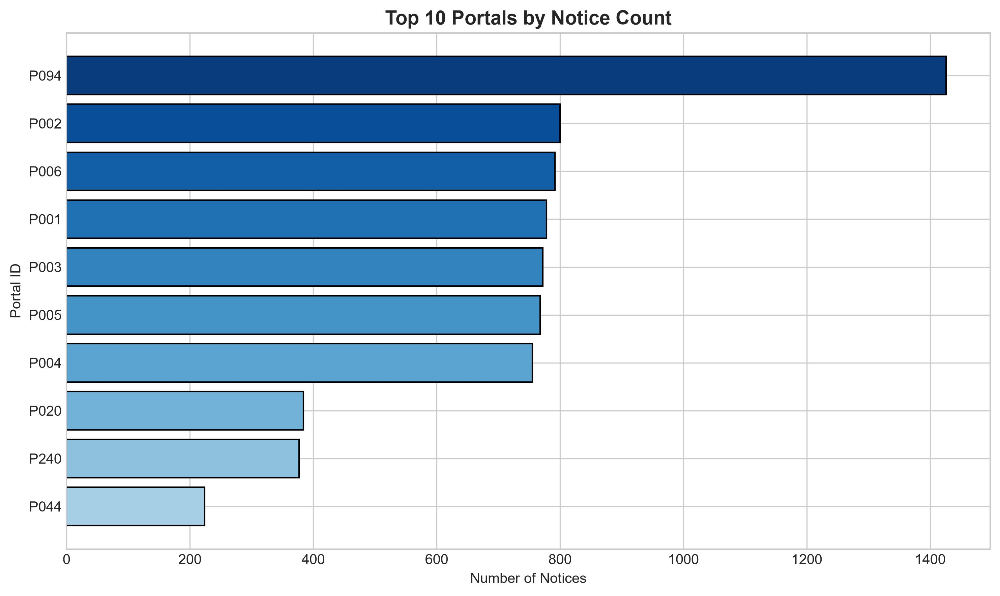
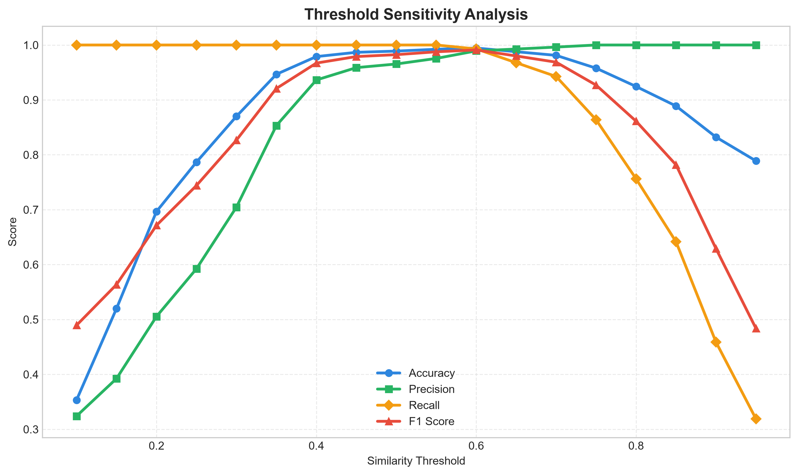

# Tender Duplicate Detection Project

This project analyzes duplicate tender notices using TF-IDF similarity, reduced SVD representations, nearest-neighbor retrieval, and SQLite indexing. The goal is to detect near-duplicate tender notices efficiently and reliably across a large corpus.

## Project Files

- `solution.py` — baseline duplicate detection using cosine similarity and threshold evaluation
- `part_b.py` — reduced-dimension representation using SVD (100 features)
- `part_c.py` — sublinear retrieval using nearest-neighbor candidate filtering
- `part_d.py` — SQLite storage and indexed lookups
- `part_e.py` — full-corpus experiment and skew analysis
- `Task2_output.txt` — consolidated output of the full task
- `portal_profiles.md` — notes about portal behavior and data characteristics

## Dataset Summary

- Total notices: 12,000
- Number of labelled pairs: 900
- Same pairs: 279
- Different pairs: 621
- Number of portals: 260
- Largest portal size: 1,426 notices
- Smallest portal size: 2 notices

## Key Results

### Part A — Baseline similarity model

Best threshold based on F1: 0.60

| Metric | Value |
|---|---:|
| Accuracy | 0.994444 |
| Precision | 0.989286 |
| Recall | 0.992832 |
| F1 Score | 0.991055 |

Confusion matrix:

- True negatives: 618
- False positives: 3
- False negatives: 2
- True positives: 277

### Part B — Reduced representation

Best threshold based on F1: 0.65

| Metric | Value |
|---|---:|
| Accuracy | 0.967778 |
| Precision | 0.934028 |
| Recall | 0.964158 |
| F1 Score | 0.948854 |

Dimensionality reduction:

- Original dimensions: 5000
- Reduced dimensions: 100
- Reduction: 98.00%

### Part C — Sublinear retrieval

| Candidate size | Retrieval recall | Time (seconds) |
|---|---:|---:|
| 10 | 0.953405 | 28.858746 |
| 25 | 0.992832 | 29.819661 |
| 50 | 0.992832 | 28.097471 |
| 100 | 0.992832 | 29.184785 |
| 200 | 0.992832 | 29.011813 |
| 500 | 0.992832 | 28.051266 |

The model achieves near-perfect recall with only a small candidate set, reducing comparisons dramatically.

### Part D — SQLite storage and indexing

| Metric | Value |
|---|---:|
| Rows stored | 12,000 |
| Database size | 61.38 MB |
| Average indexed notice lookup | 0.0496 ms |
| Index creation time | 0.0920 s |
| Database insertion time | 0.2047 s |

### Part E — Full-corpus experiment

- Before mitigation runtime: 4.6075 seconds
- Reduced representation shape: (12000, 100)
- Explained variance: 0.549169
- Portal skew exists across 260 portals, with some portals dominating the corpus

## Visual Outputs

### Main charts







### Additional colorized summary charts







## Interpretation

The baseline TF-IDF cosine-similarity model performs best overall, with a strong F1 score of 0.991. The reduced SVD representation remains competitive while providing large compression benefits. Sublinear retrieval maintains high recall with much fewer candidate comparisons, making it suitable for large-scale systems. SQLite indexing gives very fast lookup times and storage efficiency, which is useful for persistent retrieval pipelines.

## Run Instructions

From the project root:

```bash
py solution.py
py part_b.py
py part_c.py
py part_d.py
py part_e.py
```

To regenerate the extra dashboard charts:

```bash
py summary_dashboard.py
```

## Notes

The project output is also saved in `Task2_output.txt` for a single consolidated log of the results.
